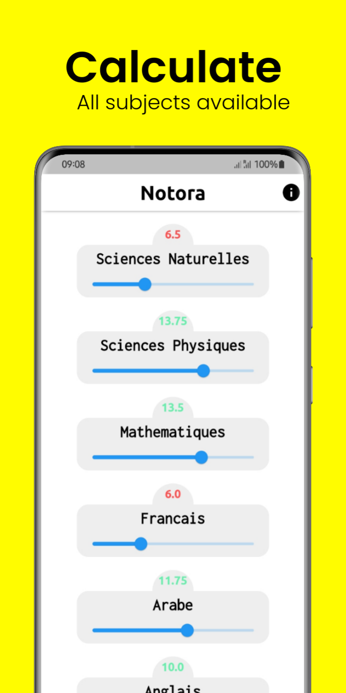
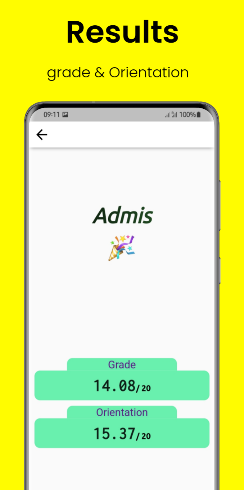

### Preview 

Home Page              |  Result Page
:-------------------------:|:-------------------------:
  |  

---

  

  

  

 

---

### Notora is Coming soon! 🥳 🚀

- Android: coming soon 👀
- iOS/macOS: coming soon 👀.
- Linux :coming soon 👀

---

 

**[PROJECT PHILOSOPHY](https://github.com/babe-saleh-mahfoud/Notora#-project-philosophy) •
[WIKI](https://github.com/babe-saleh-mahfoud/Notora#-wiki) •
[TECH STACK](https://github.com/babe-saleh-mahfoud/Notora#-tech-stack) •
[CONTRIBUTING](https://github.com/babe-saleh-mahfoud/Notora#%EF%B8%8F-contributing) •
[SPREAD THE WORD](https://github.com/babe-saleh-mahfoud/Notora#-spread-the-word) •
[LICENSE](https://github.com/babe-saleh-mahfoud/Notora#%EF%B8%8F-license)**

 

# 🧐 Project philosophy

When I was a high school senior I used all the time to take my calculator(or the calculator on my phone) and
try to predict my note for the final exam.
it was a slightly complex calculation because you have to get all subjects' notes and add them all together
and then divide the sum by 32.
This application simplifies the whole thing in easy and beautiful.

# 👨‍💻 Tech stack

Here's a brief high-level overview of the tech stack the Notora app uses:

- This project uses the [Flutter app development framework](https://flutter.dev/). Flutter is a cross-platform hybrid app development platform which allows us to use a single codebase for apps on mobile, desktop, and the web.
- For persistent storage (database), the app uses the [Shared Prefrences](https://pub.dev/packages/shared_preferences) package which allows the app to read and write simple key-value pairs. Wraps NSUserDefaults on iOS and SharedPreferences on Android.
- The app uses the font ["UbuntuMono"](https://fonts.google.com/specimen/Ubuntu+Mono) as its main font, and the design of the app adheres to the material design guidelines.

For more information on the technologies that power Notora, check out the [Tech Stack](https://github.com/babe-saleh-mahfoud/notora/wiki/Tech-Stack) page on our wiki.

# ✍️ Contributing

Interested in contributing to Notora project? Thanks so much for your interest! We are always looking for improvements to the project and contributions from open-source developers are greatly appreciated.

If you have a contribution in mind, please check out our [Contribution Guide](https://github.com/babe-saleh-mahfoud/notora/wiki/Contribution-Guide) for information on how to do so. Also, make sure you read our [Code of Conduct](https://github.com/babe-saleh-mahfoud/notora/wiki/Code-of-Conduct) to foster an encouraging sense of community.

# 🌟 Spread the word!

If you want to say thank you and/or support active development of Notora:

- Add a GitHub Star to the project!
- Tweet about the project on your Twitter!
  - Tag [@babe saleh mahfoud](https://www.linkedin.com/in/babe-saleh-mahfoud-519b52200/) and/or `#notora`
- Leave us a review [on Google Play](https://apps.apple.com/us/app/well-reboot-your-mindset/id1573357406)!

Thanks so much for your interest in growing the reach of Notora!

# ⚠️ License

Notora is free and open-source software licensed under the GNU General Public License v3.0. All the codebase is written by [Babe Saleh Mahfoud](https://github.com/babe-saleh-mahfoud) and distributed under Creative Commons license (CC BY-SA 4.0 International).

The above Illustration is attributed to [freepik.com](https://www.freepik.com/)
 

---
